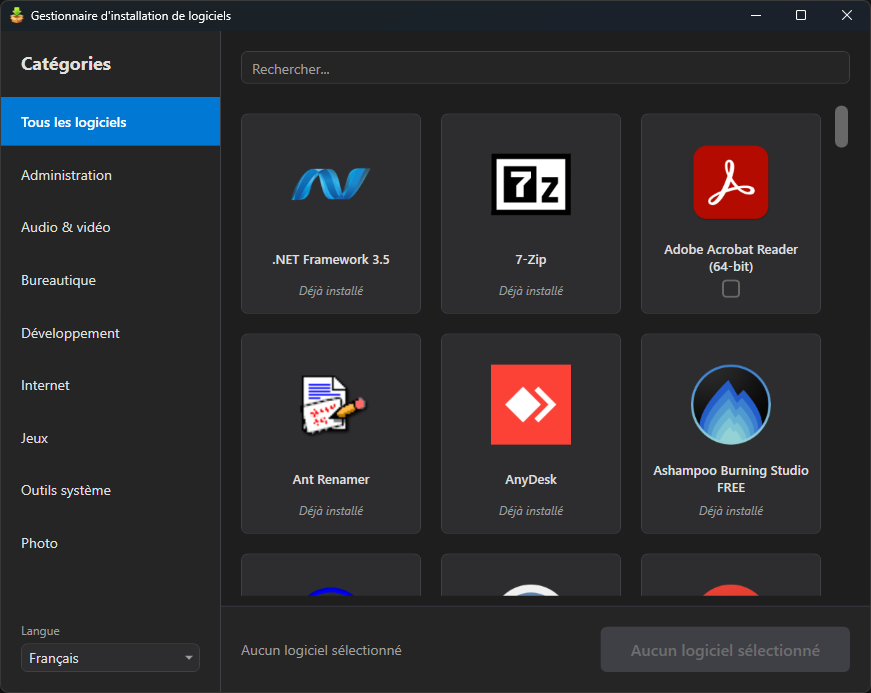

# Install-NewApps

<div>
  

  A powerful PowerShell-based software installation manager with a modern WPF graphical interface. Install applications from multiple sources including WinGet, Microsoft Store, Office Deployment Tool, and Chocolatey with a single UAC prompt.

  
  
  
</div>
<br clear="left" />

## Screenshot



## Features

- **Multi-Source Support**: Install packages from WinGet, Microsoft Store, Office Deployment Tool, Chocolatey, and Windows Features/Capabilities
- **Modern WPF Interface**: Clean, theme-aware GUI with dark/light mode support
- **Single UAC Prompt**: Batch install multiple machine-scoped packages with one elevation
- **Dependency Resolution**: Automatic detection and installation of package dependencies
- **Portable Package Support**: Install and configure portable applications with PATH management
- **Localization**: Full English and French language support
- **Installation Detection**: Intelligent detection of already-installed software
- **Category Filtering**: Organize packages by category with search functionality
- **Automatic Logging**: Installation logs saved to `%TEMP%\Install-NewApps\` for troubleshooting
- **Standalone EXE**: Includes a compiled launcher for easy execution without PowerShell knowledge

## Requirements

- Windows 10/11
- PowerShell 5.1 or later
- WinGet (Windows Package Manager)
- Administrator privileges for machine-scoped installations

## Quick Start

1. Clone the repository:
   ```powershell
   git clone https://github.com/qqt-lo4/Install-NewApps.git
   ```

2. Run the application:
   - **Simple**: Double-click `Install-NewApps.exe`
   - **PowerShell**:
   ```powershell
   .\Install-NewApps.ps1
   ```

3. Select the applications you want to install from the GUI

4. Click "Install" and approve the UAC prompt

## Documentation

- [Installation Guide](doc/INSTALLATION.md) - Detailed installation instructions
- [Configuration Guide](doc/CONFIGURATION.md) - How to configure and customize packages
- [Architecture](doc/ARCHITECTURE.md) - Technical architecture and design
- [Function Reference](doc/FUNCTIONS.md) - API documentation for main functions
- [Localization](doc/LOCALIZATION.md) - Adding new languages

## Package Sources

### WinGet
Standard Windows Package Manager packages with silent installation support. Supports `.exe`, `.msi`, `.zip`, `.msix`, and `.appx` installers.

### Microsoft Store
Windows Store applications installed via MSA token authentication. Includes support for Win32 apps distributed through the Store.

### Chocolatey
Community package manager for Windows. Used for packages not available on WinGet or the Microsoft Store (e.g., FileZilla, CDBurnerXP). Chocolatey is installed automatically via WinGet as a prerequisite.

### Windows Features & Capabilities
Native Windows components such as Hyper-V, Windows Sandbox, .NET Framework 3.5, Telnet Client, and RSAT tools. Supports both optional features (`windowsfeature`) and on-demand capabilities (`windowscapability`), with prerequisite checks (edition, architecture, build number).

### Office Deployment Tool (ODT)
Microsoft Office products with customizable XML configuration. Supports multiple products, languages, and deployment channels.

### Script
Custom PowerShell script execution for packages that require special handling. The `InstallScript` property contains arbitrary PowerShell code that is executed directly. Useful for installers that don't return control properly (e.g., Discord) or need specific commands like `winget install`.

## Project Structure

```
Install-NewApps/
├── Install-NewApps.ps1          # Main application script
├── Install-NewApps.exe          # Standalone launcher (calls the PS1)
├── .gitignore
├── input/
│   ├── apps.json                # Package definitions
│   ├── apps_custom.json         # Custom package overrides (hide/add packages)
│   ├── Install-NewApps.ico      # Application icon
│   ├── icons/                   # Package icons (PNG)
│   └── lang/
│       ├── en-US.json           # English translations
│       └── fr-FR.json           # French translations
├── UDF/                         # Reusable function modules
│   ├── PSSomeAppsThings/        # WinGet, Store, ODT, Chocolatey, program detection
│   ├── PSSomeAPIThings/         # API helper functions
│   ├── PSSomeCoreThings/        # Localization, script configuration
│   ├── PSSomeDataThings/        # Data conversion (ConvertTo-Hashtable, etc.)
│   ├── PSSomeEngineThings/      # Module management, script engine utilities
│   ├── PSSomeFileThings/        # File operations
│   ├── PSSomeGUIThings/         # WPF interface functions
│   ├── PSSomeSystemThings/      # System info, environment management
│   ├── PSSqlite/                # SQLite database access
│   └── powershell-yaml/         # YAML parsing (bundled)
├── doc/                         # Documentation
│   ├── ARCHITECTURE.md
│   ├── CONFIGURATION.md
│   ├── FUNCTIONS.md
│   ├── INSTALLATION.md
│   └── LOCALIZATION.md
└── LICENSE
```

## Usage

The entire project folder is required — the script depends on the `UDF/` modules and `input/` configuration files.

### Via the EXE launcher
Double-click `Install-NewApps.exe` — this is the simplest way for end users.

### Via PowerShell
```powershell
.\Install-NewApps.ps1
```

Logs are automatically saved to `%TEMP%\Install-NewApps\` with a timestamp.

## Supported Applications

The default configuration includes over 75 applications across categories:

| Category | Examples |
|----------|----------|
| Administration | mRemoteNG, PuTTY, RSAT tools |
| Audio/Video | Audacity, OBS Studio, Kdenlive, K-Lite Mega Codec Pack |
| Development | Git, VS Code, AutoIt, Claude Code |
| Games | Minecraft, Epic Games Launcher, Roblox, GOG Galaxy |
| Internet | Chrome, Firefox, Telegram, Discord, FileZilla |
| Office | LibreOffice, draw.io, Microsoft Office 2024, CDBurnerXP |
| Photo | GIMP, PhotoDemon, Inkscape |
| System Tools | 7-Zip, Notepad++, PowerShell, Chocolatey |

## License

This project is licensed under **[PolyForm Noncommercial License 1.0.0](https://polyformproject.org/licenses/noncommercial/1.0.0)**.

You are free to use, modify, and distribute this software for any **noncommercial purpose**. See [LICENSE](LICENSE) for full terms.
